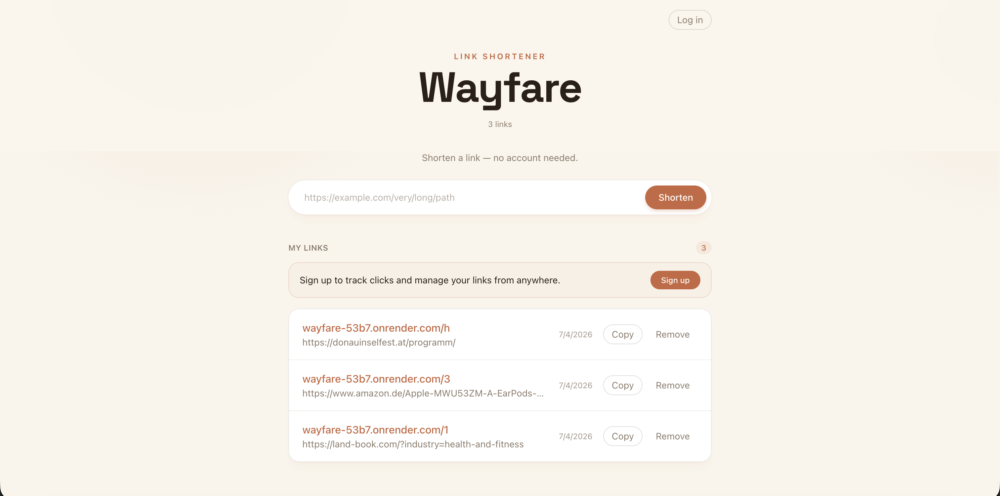

# Wayfare

> Wayfare finds the shortest path to where you're going.

Wayfare is a minimal link shortener for turning long URLs into clean, shareable
links. It supports quick anonymous shortening, optional sign-in for managing
saved links, click tracking, and QR-code downloads.

[Open Wayfare](https://wyfr.link)

## What It Does

- Shorten long links into compact Wayfare URLs.
- Use it without an account for quick one-off links.
- Sign up with your email and a password (with email verification) to keep and manage your links.
- Copy, remove, and organize saved links from a clean dashboard.
- Track clicks on signed-in links.
- Generate and download QR codes for any shortened link.
- Create links that can expire by date or click count.

## Why

Wayfare is built as a small, focused link-management tool: fast enough for
throwaway links, but useful enough to keep around when you want a personal
dashboard for links you care about.

## Status

The app is live and usable. It is still intentionally small, with future room
for richer analytics, custom domains, API access, and team/shared workspaces.
